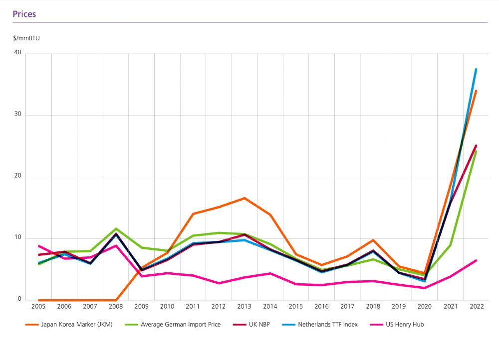
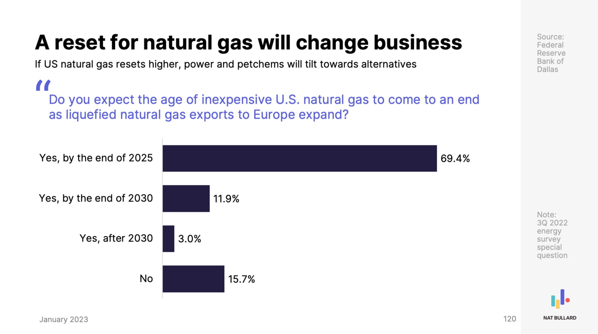

Let's examine Richmond Gas Works by the numbers.


## Customers and sales
Richmond Gas Works (RGW) is a local distribution gas utility wholly owned and operated by the city of Richmond, VA. There are five types of customers that a local distribution gas utility such as Richmond Gas Works can have: residential (households), commercial (businesses), industrial (manufacturers), electric (electric utilities who use methane gas to create electricity), and vehicle fuel (for large vehicles that run on methane gas, such as waste trucks or city busses). As you can see *most* of the customers for RGW are residential. Go ahead and zoom in or click on **Residential** and **Commercial** to deselect those groups and you can see that there are a handful of Industrial (355 in 2022) and Vehicle Fuel (4 in 2022) customers that are hard to see otherwise. (Click again to have those types reappear.)



Typically, a gas utility will sell gas to customers (pretty obvious) and the price includes the cost of gas itself as well as the cost of all the pipes to move the gas around. Large customers (typically industrial) can pay to have the utility transport gas that they purchased elsewhere, paying to use the pipelines and not the cost of gas itself. This is a small portion of what RGW does, so let's focus on gas sales. 

We can see that the vast majority of customers are **Residential**, but residential customers account for less than half of all sales, and **Industrial** users now make up almost half of gas sold.



While Industrial and Commercial users have some ability to negotiate better prices, they also have better access to capital if they ever wanted to transition off fossil fuels. This is less true of **Residential** customers, so let's focus on them.

The chart below shows that RGW has steadily added **Residential** customers over the past 25+ years, growing from fewer than 80,000 customers in 1997 to more than 110,000 today, a 36% increase since 2000.



While it may have been hard to see in the sales chart above, **Residential** sales have fallen over the same period, dropping by almost 1 million Mcf since 2000. (An Mcf is a thousand cubic feet of gas.) Residential sales are highly tied to the climate and weather as most gas goes towards space heating and water heating, which is why some years have more or less sales (cold weather means more heating and more gas sales).



With more customers and less gas sold, this means the average residential customer is using less and less gas, which we can see below. Average residential gas sales have plummetted by 36% since 2000.



While this is good for the climate that people are using less gas on average, it is not good that more and more households are getting hooked up to a fossil fuel distribution system. It is also a _financially risky_ situation for Richmond Gas Works.

Let's examine why.

## Finances of gas utilities

When a customer pays their gas bill they are paying for three things:
1. Administrative costs
1. The gas itself
1. The cost of the infrastructure, like pipelines and compressor stations, to move the gas around

You can see this broken out on the Department of Public Utilities [Utility Rates][utility_rates] page, screenshotted below (from December 2023). The admin charge is the Monthly Service Charge. The cost of gas itself is the Purchased Gas Cost Charge, which changes monthly based on current market conditions. The cost of the infrastructure is the **Volume Charge**, which has been increasing over time.

![RGW Utility Rates][RGW rates]

As we can see from the sample bill the majority of the costs aren't for the gas itself, it's for the infrastructure ($45.78 of an $87.34 bill)—the thousands of miles of pipes running throughout the city and surrounding suburbs.

Adding all these bills up and RGW residential ratepayers paid more than $118.5 million in 2022 (in constant 2019 dollars), inclusive of all adminsitrative, infrastructure, and fuel costs.



We can see how the fuel costs have changed over time by looking back at the typical prices paid by local distribution utilities in Virginia to receive gas from the pipelines. This cost of gas is directly passed on to RGW consumers. Prices rose in 2021 and 2022, but recent data shows it has fallen in 2023. 

![Virginia Citygate price][VA citygate price]

If we use this [Citygate](details/#citygate-price) price as a proxy for fuel costs, we can use it to estimate how much of the revenue that RGW received from residential customers went towards fuel and how much went towards system costs and administration. We find that **system costs have tripled** since 2000, rising from $22M to $63M in 2022. 



System costs also make up an increasing proportion of revenue, meaning each dollar spent on a gas bill goes more and more towards pipes and not towards the gas itself. Since 2011 system costs have remained above 50% of total costs, even in a high fuel price environment like 2021 and 2022. 



As we saw previously, RGW has been consistently adding customers--spreading those system costs across an increasing number of ratepayers. Despite the larger customer base, average costs per customer have continued to rise, reaching **$573 per customer** in 2022. That is, every year the typical customer pay hundreds of dollars just for the pipes in the ground, and this amount is steadily increasing. This is over double what it was in 2000, putting an increasing burden on RGW ratepayers, many of whom struggle to pay their energy bills.



Why are costs increasing so dramatically? There are a couple of drivers of long-term cost increases, for both the infrastructure and the cost of gas itself, none of which look for Richmond Gas Works or people with gas bills. The infrastructure costs are especially worrying because the Department of Public Utilities takes out loans to pay for these costs and then pays those loans back over decades.

First, is the cost of replacing the aging pipelines running through the city and the suburbs.

Second, is system expansion, such as RGW's expansion outside the city into Short Pump and other suburbs, or the building of a new Gate Station way out in Goochland. Such expansion adds millions into RGW's books which it then makes back through higher utility rates.

Third, is the increasing exposure of methane users to international markets. Until recently US consumers of methane were insulated from international pressures due to a lack of export or import infrastructure that would allow the gas to cross our borders. But this has changed in recent years, and accelerated since Putin's war in Ukraine, such that [the US is now the largest exporter][LNG] of Liquified Natural Gas (LNG) in the world. This means people are now competing on international markets for gas to heat their homes.

And fourth, is the trend towards lower consumption of gas by individual households. This comes from better building codes making houses more efficient or from [electrification][PEP], which is when people swap their furnaces, gas water heaters, or other fossil fuel machines for clean, efficient, electric alternatives, like heat pumps. When people use less gas, the costs are paid by others still on the system.

Let's explore each.


### Richmond's aging pipeline infrastructure

As of 2022, Richmond Gas Works maintains **1,974 miles of gas mains**. This is so large that if all the gas mains were laid end to end they would stretch past Salt Lake City. 



These aren't the only types of pipes. There are also services pipes, the pipes running from the mains in the street to the meters. These services pipes stretch about another 1,200 miles, bringing the total to over 3,200 miles--a distance reaching all the way to Peru. We don't know the exact distance of these pipes because the PHMSA forms report the number of services and the average distance of each service, which appears to be an estimate not an exact distance. This average distance was listed as 100 feet until 2009, which changed to 61 feet in 2010 and then 62 feet in 2012, where it has stayed. This accounts for the step down in services miles starting in 2010.



This is a lot of infrastructure for the Department of Public Utilities to maintain.

And a lot of old records to be aware of: we can see how old the pipes are in the system. We can see there are **275 miles of mains that are at least 50 years old** (pre 1960s or Unknown), some much older.



We can also see how many services there are by the decade they were installed. There are **8,881 services at least 50 years old**, stretching **104 miles** (see next chart).



From which we can calculate the number of miles of services by their age.



In addition to age, we can also see the materials the pipes are made of. 



And let's remember there are also miles of services pipes to maintain. 



Here's what it looks like all together.



The material of the pipes is important because the Pipeline and Hazardous Materials Safety Administration ([PHMSA][phmsa]), part of the US Department of Transportation and RGW's regulator, mandates that utilities develop and excecute a plan to replace [leak prone pipes](details/#leak-prone-pipes).

DPU has been very busy replacing old leak prone pipes, leaving us with 196 miles of mains remaining. 



And 118 miles of services.



That's **314 miles of leak prone pipes** still needing to be replaced.



The leak prone pipes are a small and decreasing proportion of the system, but putting pipes in the ground is a costly business, and _replacing_ pipes is net more costly than _new_ pipes. This is because when laying new pipes we're adding new customers who can offset some of the costs of the new pipes; but when replacing pipes, we're not adding new customers or revenue, just more costs. New pipes are often put in places that haven't been developed yet so there is less risk of disrupting electrical, water, or sewer service, whereas with replacement you have to worry about all those other services whenever digging.

`How costly is putting pipes in the ground?` A study of the Philadelphia municipally owned gas utility found costs to be increasing at a rate of 8.5% per year, a rate that quickly makes any infrastructure work unsustainable. The cost is already over $2 million per mile, which for Richmond would add **$628 million** in additional costs that RGW would need to get from ratepayers. Studies in New York and elsewhere have found costs to be higher still, with costs reaching $6-10 million per mile, well over **$1 billion** if applied to Richmond. RGW's own projections put the cost of pipe replacement at **$760 million**. 

This is a tremendous amount of money that will dramatically increase costs for ratepayers now and for decades to come. 

### System expansion

Second, is system expansion, such as RGW's expansion outside the city into Short Pump and other suburbs, or the building of a new Gate Station way out in Goochland. Such expansion adds millions into RGW's books which it then makes back through higher utility rates.

Richmond Gas Works has history dating back until 1856, and all that time up until about 2008, it was largely confined to the city's boundaries. 



Since 2008, RGW has increasingly focused on serving customers outside the city, stretching all the way northwest to Wyndham and southeast to Varina. The costs of running the pipes and hooking up new customers all the way out there aren't paid by the new customers, it's a cost that's shared across everyone on the system. The idea is that these new customers will eventually pay back the costs of expansion due to the decades of future gas use those new customers will consume and pay for on their gas bills.

It's not just new customers behind system expansion, RGW is also paying millions of dollars for a huge new gate station way out in Goochland. This money also comes from households paying their utility bills, a cost they will be paying back for decades. 

What makes all of this expansion a bad deal is that it's taking money out of customer pockets now in the hope that these new infrastructure costs will bring in revenue in the 2030s, 2040s, and 2050s. Unfortunately for RGW, and all of us, these pipelines and the fossil fuel machines in people's homes are major sources of pollution that we've already committed to phasing out. It doesn't make sense to keep expanding a system that won't get used and won't pay itself back.

### Exposure to international markets

It's not just infrastructure costs that are set to increase. Fuel costs are likely to go up as well. This is because of the recent construction of LNG export terminals that allow gas in the US to reach international markets. This is bad news for US households because we have historically enjoyed gas rates well below what people in other countries pay. In the chart below from the [Statistical Review of World Energy][statistical review of world energy], the US is the pink line. We can see gas prices in the US have been well below prices in other countries. This gap will shrink as US producers find higher prices elsewhere, driving up costs for domestic consumers.



These higher prices are widely anticipated by people in the gas industry as exemplified in this chart by [Nat Bullard][nat bullard] with data from the Federal Reserve Bank of Dallas. 



Competing on international markets won't just drive up average prices, it will leave US consumers at risk of price shocks, such as disruptions to gas supplies across the world from pipelines shutting down or wars. A high gas bill is bad enough, but an unexpected high gas bill is much worse.

### Reduced methane use

Finally, and related to the increased infrastruture costs, is the general trend towards lower gas use by households. One cause of lower gas use is efficiency: people in old houses insulating and air sealing their homes or new builds meeting stricter building codes. The expansion into newer neighborhoods, such as in Short Pump, could be one factor in lower average gas use due to the greater efficiency of these new builds.

Another factor in lower use is switching away from fossil fuels altogether and replacing them with clean, efficient, electric alternatives. This means swapping your furnace for a heat pump, your gas water heater for a heat pump water heater, your gas stove for induction, and your gas dryer for an electric or heat pump dryer. All these appliances are more efficient than the gas versions, with the bonus of not putting pollution in your home. These modern electric appliances are so efficient that they'll usually lower your overall energy bills, sometimes by hundreds of dollars a year.

Each time someone [electrifies][PEP] an appliance in their home they reduce their gas use or leave the gas system entirely. RGW still has to pay back the costs of its past infrastructure investments, which means they have to increase gas rates a little bit to make up for the lost revenue.


### Utility death spiral

All of which leads to a scary phrase: `utility death spiral`. This is when a utility gets caught in a vicious circle of increasing rates that cause people to consume less, leading to higher rates and lower usage, leading to higher rates... You get the point.

Going back to the utility rates we saw earlier, we saw that infrastructure costs are paid by the **Volume charge**. 
![RGW Utility Rates][RGW rates]

It works like this:

```Infastructure costs = Volume charge x Amount of gas sold```

And fuel costs are directly passed on to customers.

```Purchased gas cost = Cost of gas to RGW```

Your total bill is the sum of this plus administrative charges.

```Total bill = Infrastructure costs + Purchased gas cost + Admin```

The total **Infrastructure cost** is paid back over the **Amount of gas sold**. As the amount of gas sold decreases, which it has for the last 20+ years, the rate must go up to offset the lower gas sales and pay for investments that have already been made. 

```Infastructure costs = ⬆ Volume charge x ⬇ Amount of gas sold```

The economic drivers we just outlined (aging infrastructure, system expansion, exposure to international markets, and reduced methane use) all point towards higher energy bills for ratepayers.

Our aging pipelines and system expansion will increase infrastructure costs, which will have to be met with higher utility rates.

```⬆⬆ Infastructure costs = ⬆⬆ Volume charge x Amount of gas sold```

The exposure to international markets will lead to higher prices which will be directly paid by ratepayers.

```⬆ Purchased gas cost = ⬆ Cost of gas to RGW```

Each rate increase makes additional insulation, air sealing, or switching to electric appliances look that much better than keeping a high and increasing gas bill. People will upgrade their homes, reducing their gas bill or leaving the system entirely.

```Infastructure costs = ⬆⬆ Volume charge x ⬇⬇ Amount of gas sold```

This is a vicious circle or rising rates and lower usage that the utility will be unable to stop.

```Infastructure costs = ⬆⬆⬆ Volume charge x ⬇⬇⬇ Amount of gas sold```

Put it all together we have increased infrastructure costs met with lower usage, which will drive rates to unsustainable levels.

```⬆⬆ Infastructure costs = ⬆⬆⬆⬆ Volume charge x ⬇⬇ Amount of gas sold```

Customer bills will thus be driven up by both increased infrastructure costs and increased fuel costs.

```⬆⬆⬆⬆⬆ Total bill = Infrastructure costs ⬆⬆⬆⬆ + Purchased gas cost ⬆ + Admin```

## What this means

Richmond Gas Works is in a precarious position. We can choose to invest hundreds of millions in infrastructure to nowhere, money that will drive up energy bills and increase pollution, or we can choose to invest in helping families transition to clean electric appliances and save on their energy bills.

It's time to move Beyond Methane.

[utility_rates]: https://www.rva.gov/public-utilities/utility-rates
[VA citygate price]: assets/va_citygate.png
[phmsa]: details/#pipeline-and-hazardous-materials-administration-phmsa
[LNG]: https://www.reuters.com/business/energy/us-was-top-lng-exporter-2023-hit-record-levels-2024-01-02/
[statistical review of world energy]: https://www.energyinst.org/statistical-review
[nat bullard]: https://www.nathanielbullard.com/presentations
[PEP]: https://homes.rewiringamerica.org/
[RGW rates]: assets/rgw_gas_rates.png