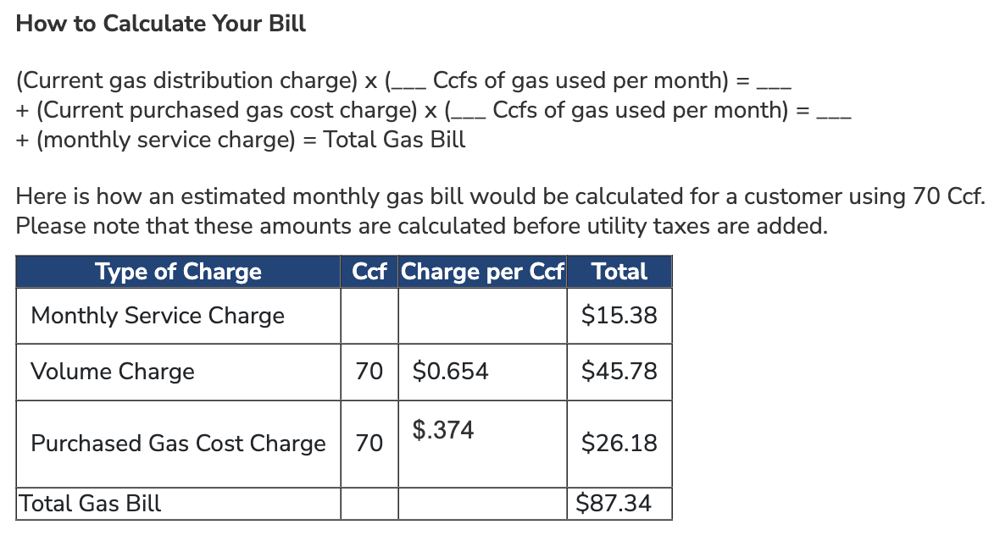

Let's examine Richmond Gas Works by the numbers.

## Customers and sales
Richmond Gas Works (RGW) is a local distribution gas utility wholly owned and operated by the city of Richmond, VA. There are five types of customers that a local distribution gas utility such as Richmond Gas Works can have: residential (households), commercial (businesses), industrial (manufacturers), electric (electric utilities who use methane gas to create electricity), and vehicle fuel (for large vehicles that run on methane gas, such as waste trucks or city busses). As you can see *most* of the customers for RGW are residential. Go ahead and zoom in or click on **Residential** and **Commercial** to deselect those groups and you can see that there are a handful of Industrial (355 in 2022) and Vehicle Fuel (4 in 2022) customers that are hard to see otherwise. (Click again to have those types reappear.)



Typically, a gas utility will sell gas to customers (pretty obvious) and the price includes the cost of gas itself as well as the cost of all the pipes to move the gas around. Large customers (typically industrial) can pay to have the utility transport gas that they purchased elsewhere, paying to use the pipelines and not the cost of gas itself. This is a small portion of what RGW does, so let's focus on gas sales. 

We can see that **Residential** customers make up a much smaller fraction of gas sales than customers, and **Industrial** users now make up almost half of gas sold.



While Industrial and Commercial users have some ability to negotiate better prices, they also have better access to capital if they ever wanted to transition off fossil fuels. This is less true of **Residential** customers, so let's focus on them.

The chart below shows that RGW has steadily added **Residential** customers over the past 25+ years, growing from fewer than 80,000 customers in 1997 to more than 110,000 today, a 36% increase since 2000.



While it may have been hard to see in the sales chart above, **Residential** sales have fallen over the same period, dropping by almost 1 million Mcf since 2000. (An Mcf is a thousand cubic feet of gas.) Residential sales are highly tied to the climate and weather as most gas goes towards space heating and water heating, which is why some years have more or less sales (cold weather means more heating and more gas sales).



With more customers and less gas sold, this means the average residential customer is using less and less gas, which we can see below. Average residential gas sales have plummetted by 36% since 2000.



While this is good for the climate that people are using less gas on average, it is not good that more and more households are getting hooked up to a fossil fuel distribution system. It is also a _financially risky_ situation for Richmond Gas Works.

Let's examine why.

## Finances of gas utilities

When a customer pays their gas bill they are paying for three things:
1. Administrative costs
1. The gas itself
1. The cost of the infrastructure, like pipelines and compressor stations, to move the gas around

You can see this broken out on the Department of Public Utilities [Utility Rates][utility_rates] page, screenshotted below (from December 2023). The admin charge is the Monthly Service Charge. The cost of gas itself is the Purchased Gas Cost Charge, which changes monthly based on current market conditions. The cost of the infrastructure is the **Volume Charge**, which has been increasing over time.

As we can see from the sample bill the majority of the costs aren't for the gas itself, it's for the infrastructure ($45.78 of an $87.34 bill)—the thousands of miles of pipes running throughout the city and surrounding suburbs.

Adding all these bills up and RGW residential ratepayers paid more than $118.5 million in 2022 (in constant 2019 dollars), inclusive of all adminsitrative, infrastructure, and fuel costs.



We can see how the fuel costs have changed over time by looking back at the typical prices paid by local distribution utilities in Virginia to receive gas from the pipelines. This cost of gas is directly passed on to RGW consumers. Prices rose in 2021 and 2022, but recent data shows it has fallen in 2023. 

![Virginia Citygate price][VA citygate price]

If we use this Citygate price as a proxy for fuel costs, we can use it to estimate how much of the revenue that RGW received from residential customers went towards fuel and how much went towards system costs and administration. We find that **system costs have tripled** since 2000, rising from $22M to $63M in 2022. 



System costs also make up an increasing proportion of revenue, meaning each dollar spent on a gas bill goes more and more towards pipes and not towards the gas itself. Since 2011 system costs have remained above 50% of total costs, even in a high fuel price environment like 2021 and 2022. 



As we saw previously, RGW has been consistently adding customers--spreading those system costs across an increasing number of ratepayers. Despite the larger customer base, average costs per customer have continued to rise, reaching **$573 per customer** in 2022. That is, every year the typical customer pay hundreds of dollars just for the pipes in the ground, and steadily increasing. This is over double what it was in 2000, putting an increasing burden on RGW ratepayers, many of whom struggle to pay their energy bills.



Why are costs increasing so dramatically? Let's take a look.

## Drivers of costs

* Replacement adds costs without increasing revenue
* Replacement is increasingly costly
* RGW has been extending into the suburbs, requiring more miles of mains for each household
* Compressor station in Goochland: perhaps further expansion and huge costs

## Pipeline miles



[utility_rates]: https://www.rva.gov/public-utilities/utility-rates
[VA citygate price]: assets/va_citygate.png