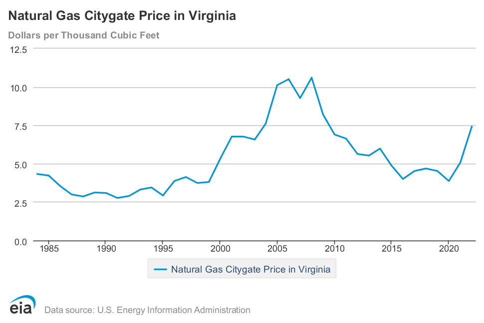

# Data sources
**How did we make all these charts anyway**

## Energy Information Agency (EIA)
The EIA is an organization under the Department of Energy that tracks information about energy use in the US, including prices, amount sold, power plants, utilities, and a lot more. The primary data from the EIA used here is from [Form 176][EIA 176]. EIA 176 is a form completed by gas utilities that tracks the number of customers, revenue, and amount of gas sold broken down by industry (residential, commercial, industrial, electric, and vehicle fuel). This is information provided directly by RGW to the EIA. Data are available back to 1997 and are released annually in October; the next release will be in October 2024 for 2023 data.

We also get the [Citygate pricing](#citygate-price) from EIA.

## Pipeline and Hazardous Materials Administration (PHMSA)

Similar to EIA 176, RGW submits an annual report to the [Pipeline and Hazardous Materials Administration][PHMSA] (part of the Deparment of Transportation). This report details the pipelines controlled by the utility, broken down by miles of pipes and numbers of [services](#services) in the system. It reports the sizes of the pipes and the materials the pipes are made with by miles of mains and by number of services. This is useful to understand how big the system is overall, and how much [leak prone pipes](#leak-prone-pipes) remain in the system.

## Freedom of Information Act (FOIA)

We have collected data from Richmond Gas Works via [FOIA][FOIA] requests.

# Glossary
**Terms and units of measure**

### `Citygate price`
[From the EIA][definitions]: "A point or measuring station at which a distributing gas utility receives gas from a natural gas pipeline company or transmission system." [Virginia's Citygate price][VA citygate] shows that since 2008 we've largely been in a low price era, with recent price increases that have largely fallen again in 2023.

### `Leak prone pipes`
Leak prone pipes are pipes made of materials that have historically been found to degrade and leak gas: cast iron, wrought iron, copper, unprotected steel (any steel that is not both coated and cathodically protected), and some types of plastics from the 1970s. Federal legislation, including the [PIPES Act][PIPES Act] of 2020, requires utilities to create and execute a plan to eliminate leaks by replacing all leak prone pipes in the system. This is driving major pipeline replacement investment, a financially risky proposition for utilities that will expect to be paid back for those investments over the same decades that we will be decarbonizing the entire economy and phasing out our use of gas. Some utilities in Maryland are even trying to expand the definition of leak prone pipes in order to cram in more investment. 

### `Local distribution company (LDC)`
Also know as local distribution utilities. These are the utilities that control local distribution networks and bill customers. 

### `Main`
A gas main is a pipe, typically a medium-sized pipe under moderate pressure. Think of this as the pipes running down your street.

### `Pipeline`
This is a generic term which could mean any kind of gas pipe, but typically refers to a medium to large pipe such as a gas main or a transmission pipeline that carries gas long distances.

### `Services`
This is a fancy way of describing the small pipes that connect a gas main to a meter. This is what runs through your hard from the street to your house.

### `Transmission pipeline`
Large high-pressure pipes that carry gas long distances.

## Units
`Mcf`
see also: `ccf`
An `Mcf` is a thousand (M) cubic feet (cf) of gas. A `ccf` is a hundred cubic feet of gas. Your gas bill reports consumption in `ccf` but figures from the EIA come in `Mcf`. 

[definitions]: https://www.eia.gov/dnav/ng/TblDefs/ng_pri_sum_tbldef2.asp
[VA citygate]: https://www.eia.gov/dnav/ng/hist/n3050va3A.htm
[EIA 176]: https://www.eia.gov/naturalgas/ngqs/#?year1=2019&year2=2022&company=Name
[PHMSA]: https://www.phmsa.dot.gov/data-and-statistics/pipeline/pipeline-mileage-and-facilities
[FOIA]: https://www.opengovva.org/virginias-foia-resources
[PIPES Act]: https://pipelinesafety.dot.gov/sites/phmsa.dot.gov/files/2022-03/Section_114_Webinar.pdf